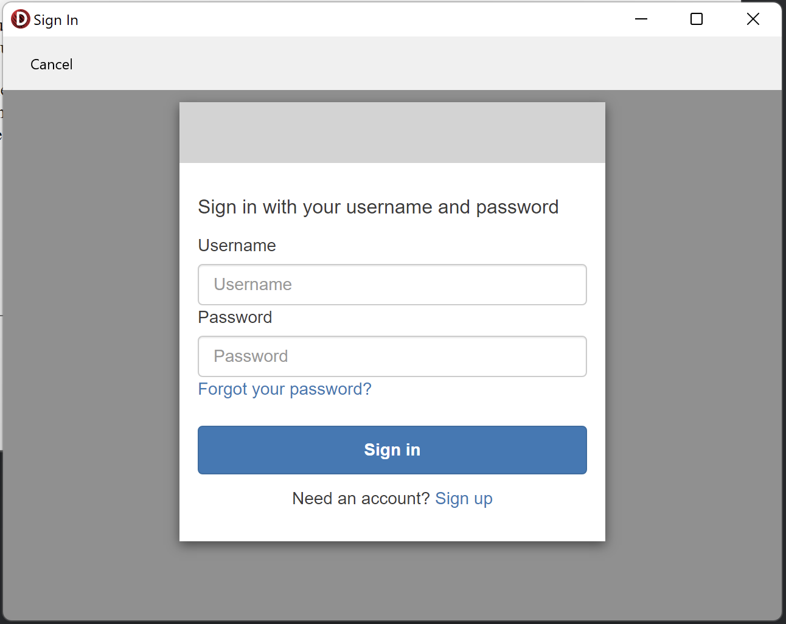
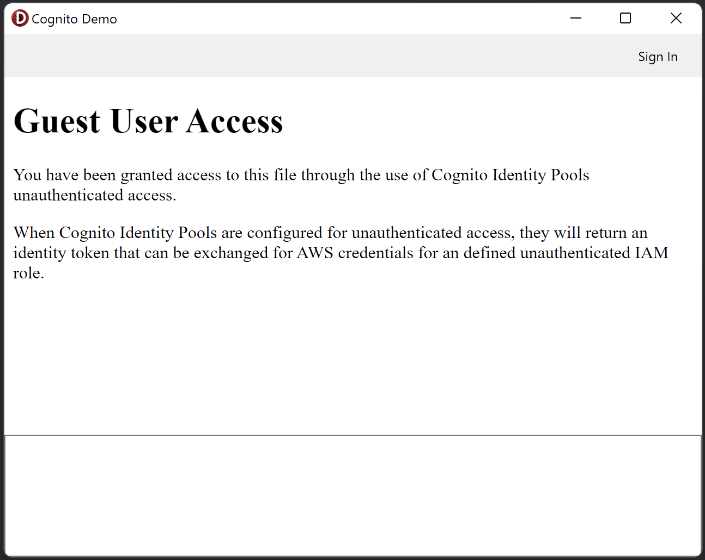
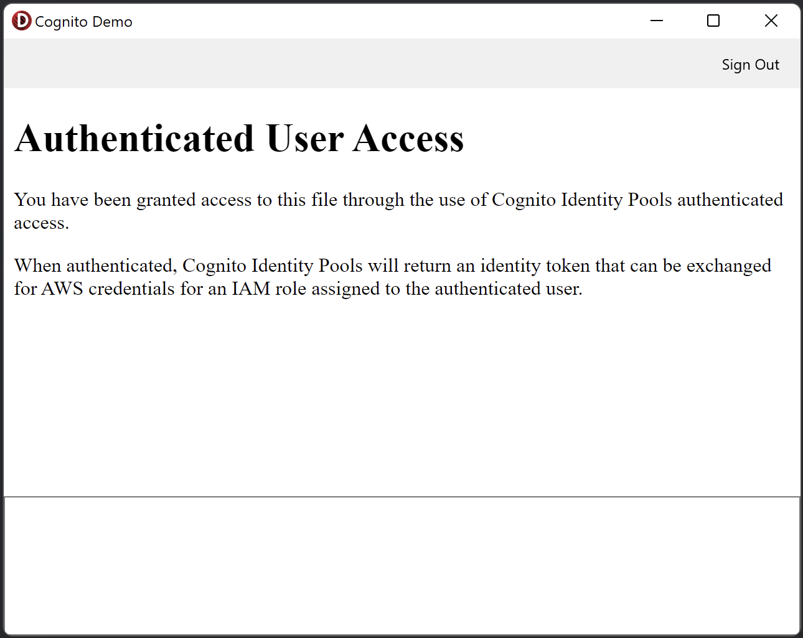

# Amazon Cognito Demo in Delphi
The CognitoDemo application demonstrates the use of the Amazon Cognito Hosted UI
in Delphi with the TCognitoHostedUI component provided in the Appercept AWS SDK
for Delphi.

The application demonstrates accessing AWS resources (S3) with
ICognitoAWSCredentials/TCognitoAWSCredentials. The TCognitoAWSCredentials
automatically resolves AWS credentials based on the available identity tokens.
If no token is provided, and, if the Amazon Cognito Identity Pool configuration,
the TCognitoAWSCredentials can resolve "unauthenticated" credentials allowing
access to services defined by an IAM role for unauthenticated users.

The TCognitoHostedUI component is used to sign users in/out of an Identity
Provider (IdP) provided by an Amazon Cognito User Pool. Once authenticated, the
returned identity token is added to the TCognitoAWSCredentials allowing access
to resources for authenticated users.

## Requirements
- [AWS Account](https://aws.amazon.com)
- Embarcadero [RAD Studio](https://www.embarcadero.com/products/rad-studio) /
  [Delphi](https://www.embarcadero.com/products/delphi)
- [Appercept AWS SDK for Delphi](https://getitnow.embarcadero.com/aws-sdk-for-delphi-preview/)
- [EdgeView2 SDK](https://getitnow.embarcadero.com/edgeview2-sdk/)

## Setup
In order to run the sample apps, resources need to be deployed on AWS.

1. Sign in to the [AWS Console](https://console.aws.amazon.com/).
2. Navigate to the [AWS CloudFormation Console](https://console.aws.amazon.com/cloudformation/home).
3. Create a stack based on the `CloudFormation/IdentityProvider.yml` template.
   Specify a "Stack name" and accept all defaults.
4. Upload the `Templates/guests.html` to the `GuestBucket` created by the
   CloudFormation template and rename it to `index.html`.
5. Upload the `Templates/known_users.html` to the `KnownUserBucket` created by
   the CloudFormation template and rename it to `index.html`.

## Compiling and running the apps
Once you have followed the setup to deploy the AWS resources, you can compile
and run the demo applications.
1. Open the `Source\CognitoDemo.dproj`.
2. The constants defined in the `Settings.pas` files marry up to the outputs
   published from the CloudFormation stack. Copy and paste the values from the
   CloudFormation console.
3. Build the project (don't run it).
4. Copy the `WebView2Loader.dll` into the build directory.
3. Run the project.

## Costs
The resources used in this demo have costs but are minimal. Some services have a
"free tier" so this demonstration would not incur fees for some of the resources
used. For detailed explanation of potential costs refer to Amazon's pricing
guides for the relevant services:
- https://aws.amazon.com/cognito/pricing/
- https://aws.amazon.com/s3/pricing/

## Cleaning up
After running the demo you will want to clean up the resources created to save
any potential ongoing costs. Follow these steps:
1. Navigate to the [Amazon S3 console](https://s3.console.aws.amazon.com).
2. Empty the buckets created as a part of the CloudFormation stack. If you're
   unsure of the buckets created, refer to the "Resources" tab on the
   CloudFormation stack details.
3. Delete the CloudFormation stack.
