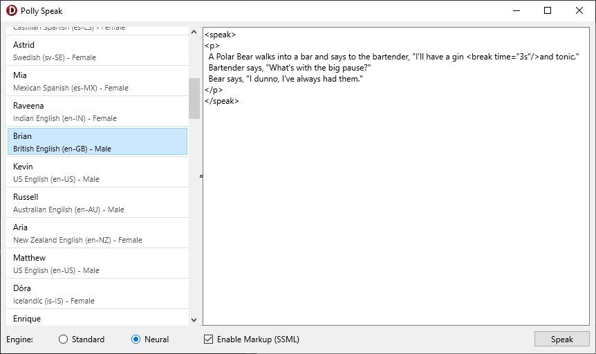

# Polly Speak
Polly Speak demonstrates the `DescribeVoices` and `SynthesizeSpeech` methods on
`TPollyClient`.


## Running the sample
1. Open “PollySpeak.dproj” in Delphi or RAD Studio.
2. Select “Run \> Run” from the menu or press F9.
3. Select a voice from the list on the left.
4. Choose _Standard_ or _Neural_ if the voice supports _Neural_ from the radio
   at the bottom.
5. Check the option to enable markup if you choose.
6. Enter some text to speak in the large memo. Remember to enter valid SSML if
   you’ve enabled markup.
7. Click **Speak**.

## Using markup (SSML)
Speech Synthesis Markup Language (SSML) can be used to control and enhance
speech generation. If you enable markup, you must, at a minimum, surround the
text with a top-level `speak` tag. For example:
```xml
<speak>
Hello!
</speak>
```

Adding a pause can be achieved by adding a `<break time="3s"/>` tag in the
appropriate place. Check out Amazon’s documentation for details on the
[Supported SSML Tags](https://docs.aws.amazon.com/polly/latest/dg/supportedtags.html)
with Amazon Polly.
