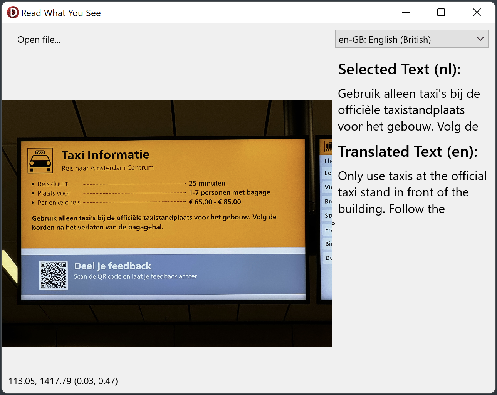

# Read What You See
Read What You See is a demo that does exactly what it says.
It's a demo that combines multiple AWS services to first detect text within an
image (Amazon Textract). When text is clicked on, it will be selected,
translated (Amazon Translate), and spoken (Amazon Polly).

## Running the sample
1. Open “ReadWhatYouSee.dproj” in Delphi or RAD Studio.
2. Select “Run \> Run” from the menu or press F9.
3. Click on "Open file...".
4. Select an image file that contains text.
5. Once the image has loaded, you can click on text in the image for it to be
   selected.
6. You can choose the output language from the drop-down on the top-left.
