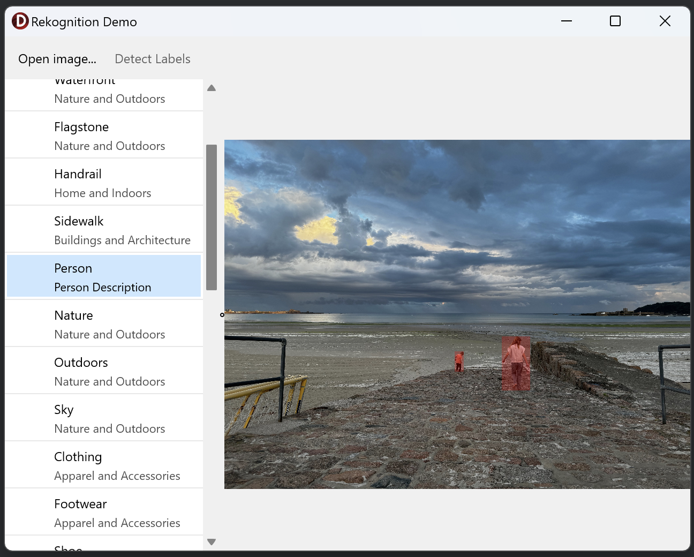

# Rekognition Demo
The Rekognition Demo sample demonstrates the use of `DetectLabels` of
`TRekognitionClient` to identify objects and concepts within an image.

## Running the sample
1. Open “RekognitionDemo.dproj” in Delphi or RAD Studio.
2. Select “Run \> Run” from the menu or press F9.
3. Click the “Open Image…” button and choose an image file containing text.
4. Click “Detect Labels”.
5. Once the list of detected labels is populated on the left, you can select an
   item to highlight on the image. Note that some items listed won't have
   instances within the image as they are general scene information.
