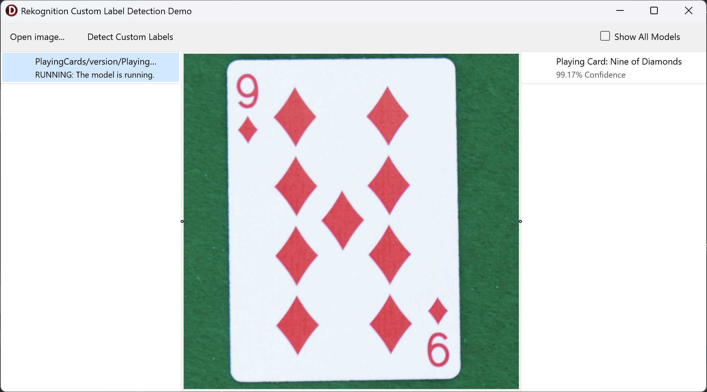

# Rekognition Demos
There are three Rekognition sample projects:
- `LabelDetectionDemo` demostrating the use of `DetectLabels` of
  `TRekognitionClient` to identify objects and concepts within an image.
- `CustomLabelDetectionDemo` demostrating the use of `DetectCustomLabels` of
  `TRekognitionClient` to identify objects and concepts within an image.
- `ContentModerationDemo` demonstrating the use of `DetectModerationLabels` of
  `TRekognitionClient` to detect potentially unsuitable content.

## Label Detection

###  Running the label detection sample
1. Open "Rekognition Demos.groupproj" in Delphi or RAD Studio.
2. Activate the LabelDetectionDemo.exe project.
3. Select "Run \> Run" from the menu or press F9.
4. Click the "Open Image…" button and choose an image file.
5. Click "Detect Labels".
6. Once the list of detected labels is populated on the left, you can select an
   item to highlight on the image. Note that some items listed won't have
   instances within the image as they are general scene information.

## Custom Label Detection

###  Running the custom label detection sample
NOTE: To run this demo, you will need a pre-trained Amazon Rekognition Custom
Labels projects running in your account.
1. Open "Rekognition Demos.groupproj" in Delphi or RAD Studio.
2. Activate the CustomLabelDetectionDemo.exe project.
3. Select "Run \> Run" from the menu or press F9.
4. Select a model from the list of running models on the left. Note, this list
   will be empty if there are no running models in your AWS account.
5. Click the "Open Image…" button and choose an image file.
6. Click "Detect Custom Labels".
7. Once the list of detected labels is populated on the right, you can select an
   item to highlight on the image. Note that some items listed won't have
   instances within the image as they are general scene information.

## Content Moderation

###  Running the content moderation sample
1. Open "Rekognition Demos.groupproj" in Delphi or RAD Studio.
2. Activate the "ContentModerationDemo.exe" project.
3. Select "Run \> Run" from the menu or press F9.
4. Click the "Open Image…" button and choose an image.
5. Click "Detect Moderation Labels". If no content moderation labels are
   detected, the image will be revealed automatically.
6. When an image remains blurred, it means content moderation labels were
   detected. Inspect the detected moderation labels in the list on the left.
   If you wish to reveal the image, you can select the "Reveal" checkbox on the
   top-right.
