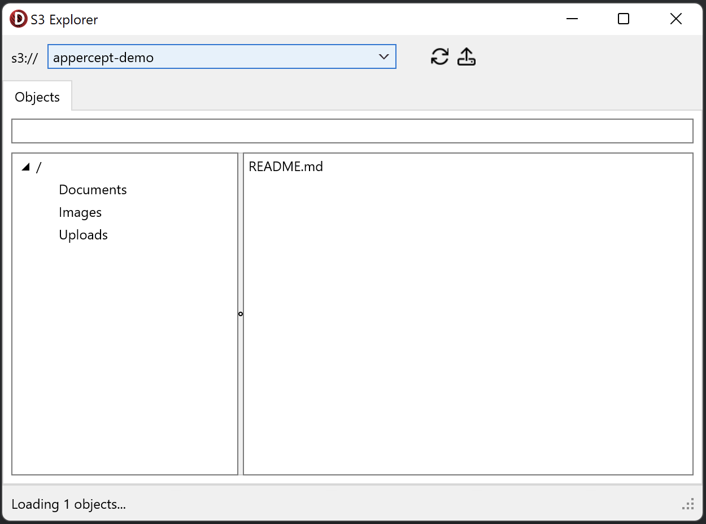

# S3 Explorer
S3 Explorer demonstrates using Amazon S3 with the Appercept AWS SDK.

## What is demonstrated?
1. Listing buckets.
2. Navigating the contents of a bucket using prefixes (like a filesystem).
3. Multi-part uploads.
4. Inspecting objects.
5. Downloading objects.

## Running the sample
1. Open “S3Explorer.dproj” in Delphi or RAD Studio.
2. Select “Run \> Run” from the menu or press F9.
3. Select a bucket from the dropdown list at the top.
4. Navigate folders using the tree view on the left and inspect stored objects using the list on the right.
5. To inspect the details of an object, double-click it.
6. To upload an object, click the “Upload File…” button on the toolbar.
