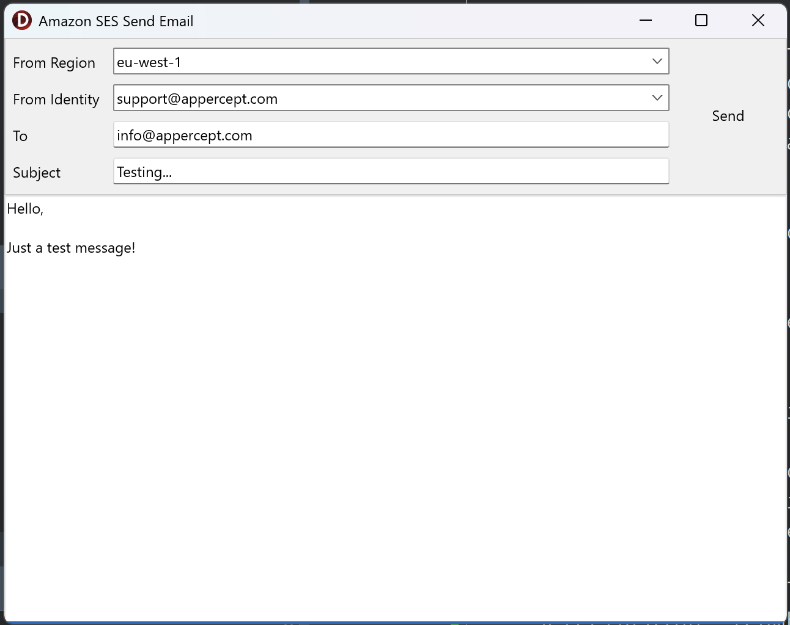

# Send Email (Simple Email Service)
The Send Email sample demonstrates using Simple Email Service (SES) to send a
simple email.
The following actions of `TSESV2Client` are featured in the sample:
1. Fetching a list of valid sending identities using `ListEmailIdentities`.
2. Sending an email using `SendEmail`.

## Running the sample
1. Open "SendEmail.dproj" in Delphi or RAD Studio.
2. Select “Run \> Run” from the menu or press F9.
3. Select a region in the "From Region" selector.
4. Select an identity to send from using the "From Identity" selector.
5. Enter a valid email address to receive the message in the "To" input.
6. Enter a subject and write the message content.
7. Click "Send" when ready to send the email.

## Further Reading
To learn more about the features of Amazon Simple Email Service, have a read of
the [Amazon Simple Email Service Developer Guide](https://docs.aws.amazon.com/ses/latest/dg/Welcome.html).

