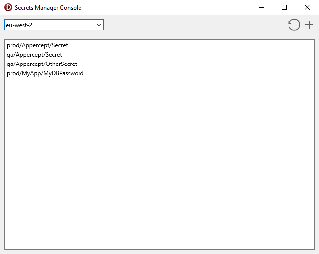

# Secrets Manager Console
Secrets Manager Console demonstrates the following features of
`TSecretsManagerClient` and AWS Secrets Manager:
1. Querying secrets using `ListSecrets`.
2. Creating secrets using `CreateSecret`.
3. Fetching secrets using `DescribeSecret` to retrieve meta-data and
    `GetSecretValue` to retrieve the stored secret.

When creating secrets, this demo also shows the use of AWS Key Management
Service (AWS KMS) to query KMS keys to use with Secrets Manager. The `ListKeys`,
`DescribeKey`, and `ListAliases` methods of `TKMSClient` are demonstrated.

## Running the sample
1. Open "SecretsManagerConsole.dproj" in Delphi or RAD Studio.
2. Select “Run \> Run” from the menu or press F9.
3. Select a region from the list on the top-left.
4. To create a new secret, click the "+" sign on the top-right.
5. To view information or retrieve the secret value, double-click a secret in
    the list.

## Further Reading
To learn more about the features of AWS Secrets Manager, have a read of the
[AWS Secrets Manager Use Guide](https://docs.aws.amazon.com/secretsmanager/latest/userguide/index.html).

To learn more about the features of AWS Key Management Service (AWS KMS), have a
read of the
[AWS Key Management Service User Guide](https://docs.aws.amazon.com/kms/latest/developerguide/index.html).
