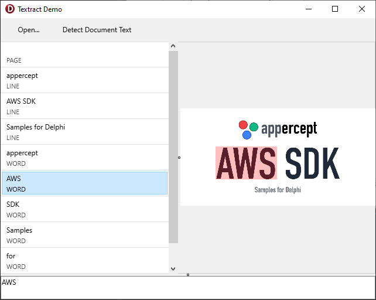

# Textract Demo
The Textract Demo sample demonstrates the use of `DetectDocumentText` of
`TTextractClient`.

## Running the sample
1. Open “TextractDemo.dproj” in Delphi or RAD Studio.
2. Select “Run \> Run” from the menu or press F9.
3. Click the “Open…” button and choose an image file containing text.
4. Click “Detect Document Text”.
5. Once the list of detected items is populated on the left, you can select an
   item to highlight on the image.
