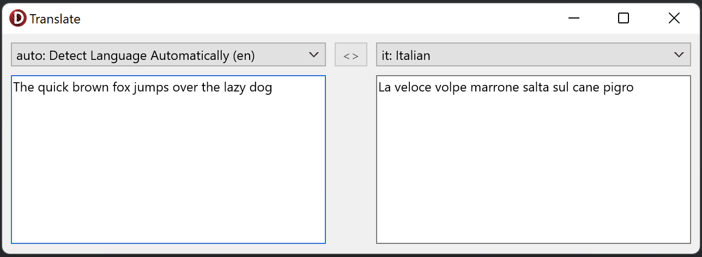

# Translate Demo
The Translate Demo sample demonstrates the use of `ListLanguages` and
`TranslateText` of `TTranslateClient`.

## Running the sample
1. Open “Translate.dproj” in Delphi or RAD Studio.
2. Select “Run > Run” from the menu or press F9.
3. Select a target language from the combo list on the top-right.
4. Write some text to translate in the left memo and hit enter to translate.