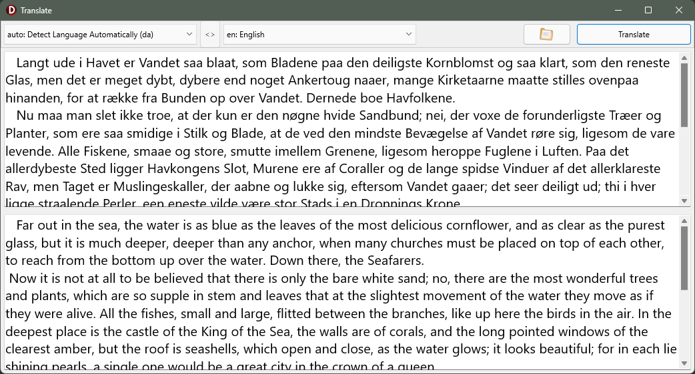

# Translate Demo
The Translate Demo sample demonstrates the use of `ListLanguages` and
`TranslateText` of `TTranslateClient`.

## Running the sample
1. Open “Translate_skiaversion.dproj” in Delphi or RAD Studio.
2. Select “Run > Run” from the menu or press F9.
3. Select a target language from the combo list on the top-right.
4. Write some text to translate in the left memo and hit enter to translate
   or
   click on the animated file open button and select a text file.
   
There are two example text files in the "smaples" folder. They contain
text which is in the public domain - one in Danish, one in French.

**Note that this version was created using RAD Studio 12.3 with Skia enabled.**